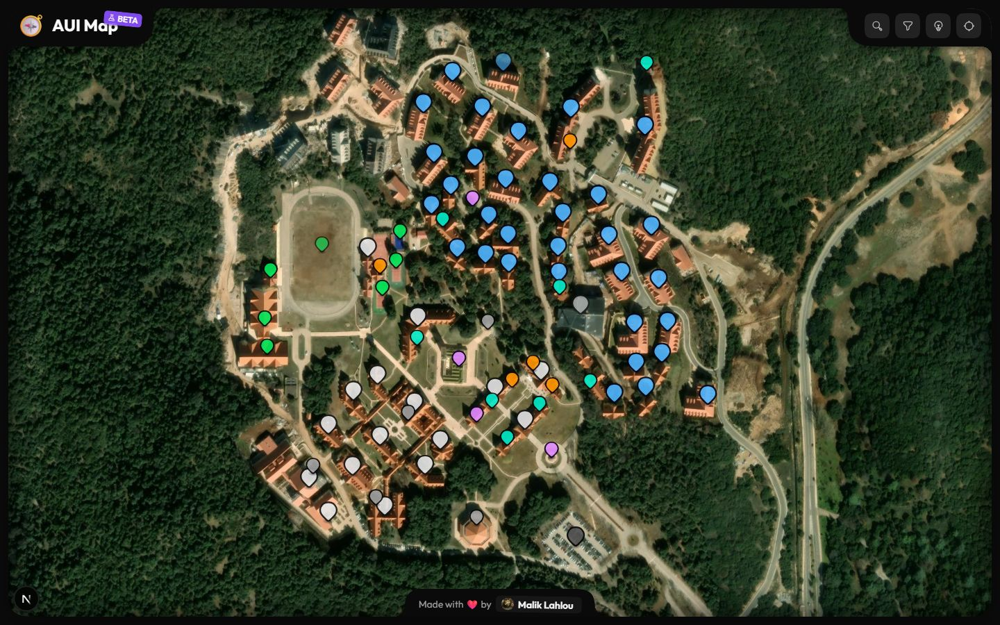
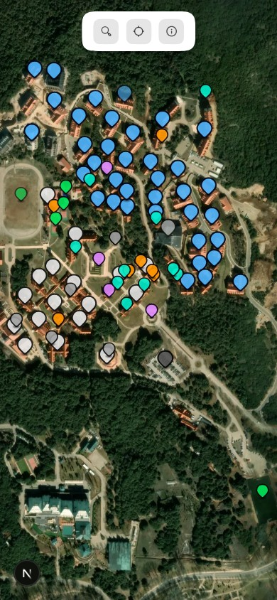
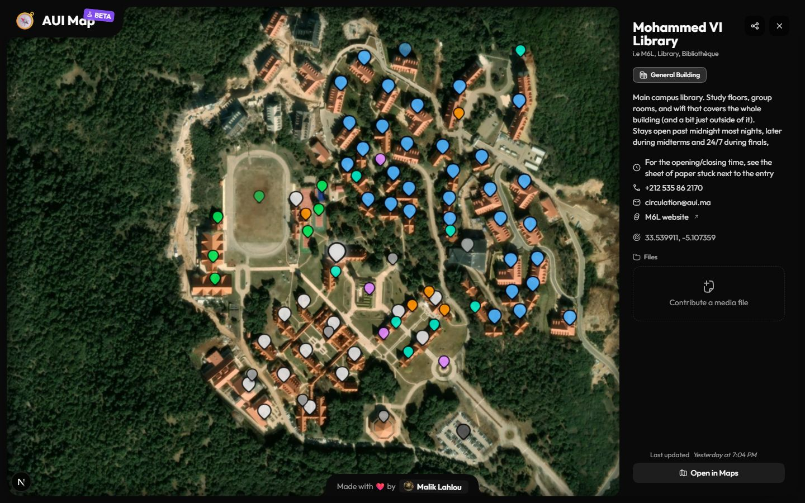
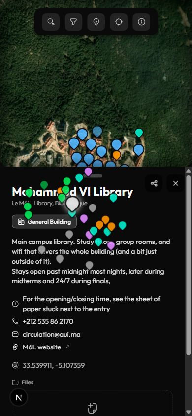
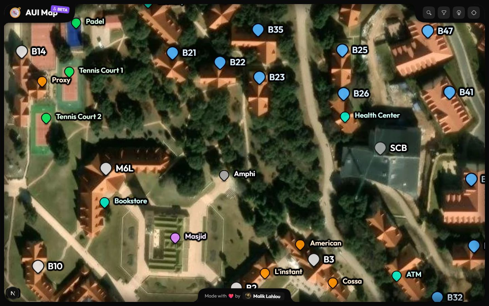
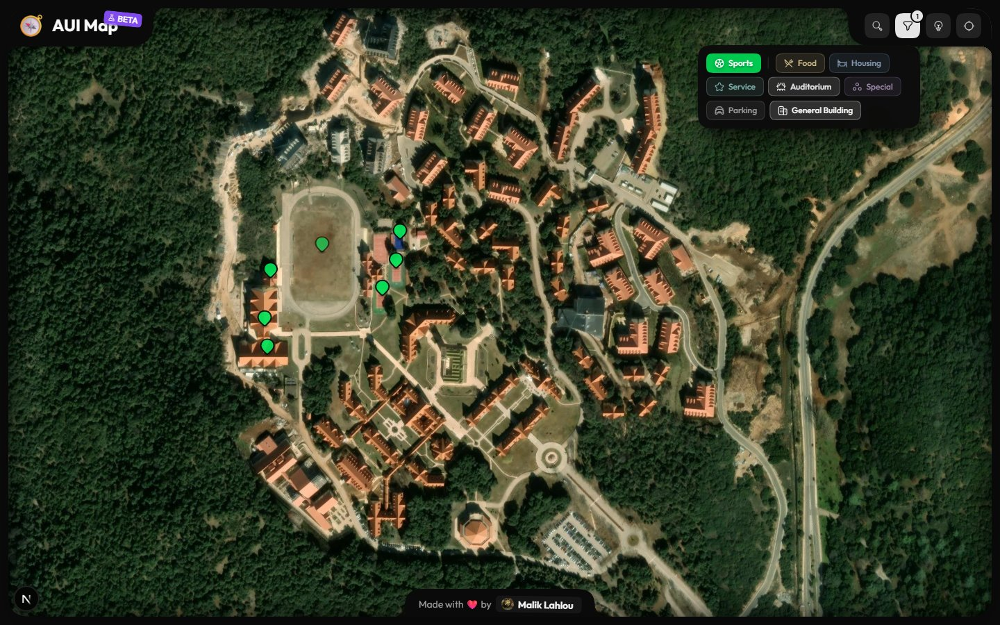
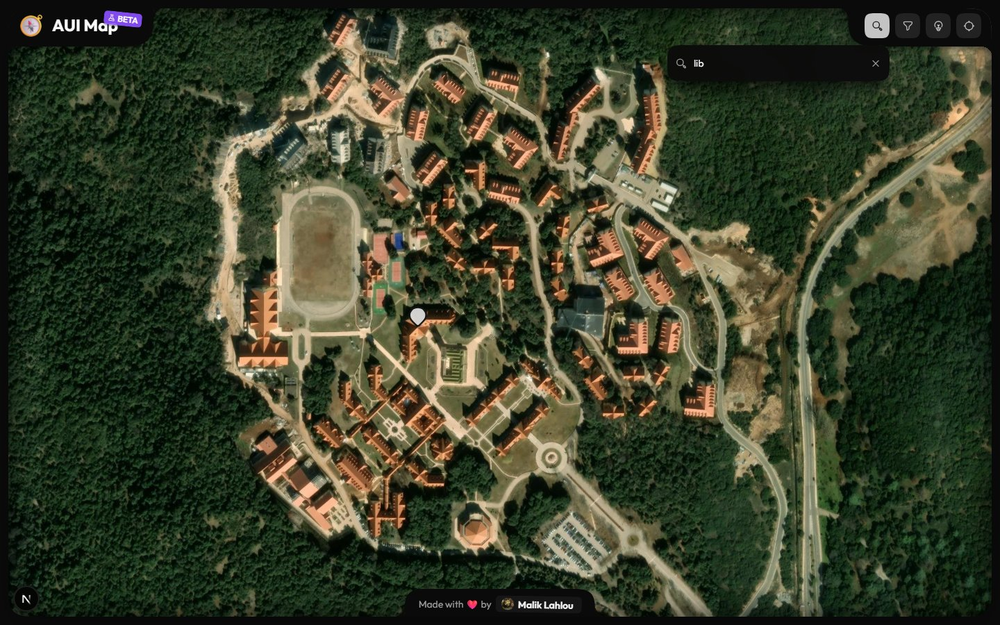
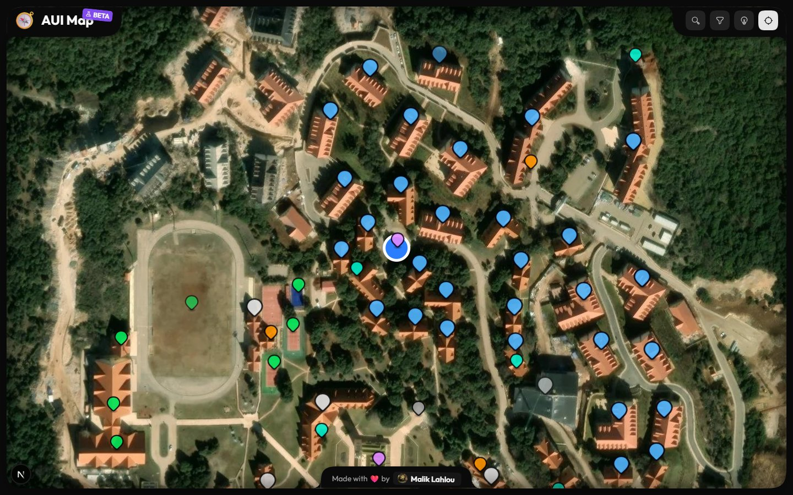

# AUI Map

An interactive, unofficial campus map for Al Akhawayn University — every academic, administrative, athletic, and housing building, restaurant, shop, parking area, and special place, with photos, videos, contacts, and opening hours. Not owned, run, or endorsed by the university.

Live at [auimap.ma](https://auimap.ma).

|                                  Desktop                                  |                                 Mobile                                  |
| :------------------------------------------------------------------------: | :------------------------------------------------------------------------: |
|  |  |
|  |  |
|  |  |
|  |  |

## Features

- Pan/zoom campus map with tag-colored, searchable, filterable pins
- Pin detail panel with photos/videos, hours, contacts, links, and directions (Google Maps, Apple Maps, Waze)
- Live location with compass heading, and a "center me" button
- Anyone can suggest edits or contribute photos to a pin — no account needed
- Installable PWA with offline support
- Admin dashboard to manage pins, tags, and incoming suggestions

## Stack

- [`Next.js`](https://nextjs.org/) 16 (App Router, Turbopack) · [`TypeScript`](https://www.typescriptlang.org/) 5 · [`React`](https://react.dev/) 19
- [`Prisma`](https://www.prisma.io/) 7 + Postgres (Neon), [`Vercel Blob`](https://vercel.com/docs/vercel-blob) for photo/video uploads
- [`Tailwind CSS`](https://tailwindcss.com/) 4 · [`shadcn`](https://ui.shadcn.com/) (Nova style, Neutral theme, Medium radius, [`Outfit`](https://fonts.google.com/specimen/Outfit) font) · [`Hugeicons`](https://hugeicons.com/)
- [`motion`](https://motion.dev/) for pin/panel animation, [`serwist`](https://serwist.pages.dev/) for the offline-capable PWA service worker
- [`Biome`](https://biomejs.dev/) · [`pnpm`](https://pnpm.io/)
